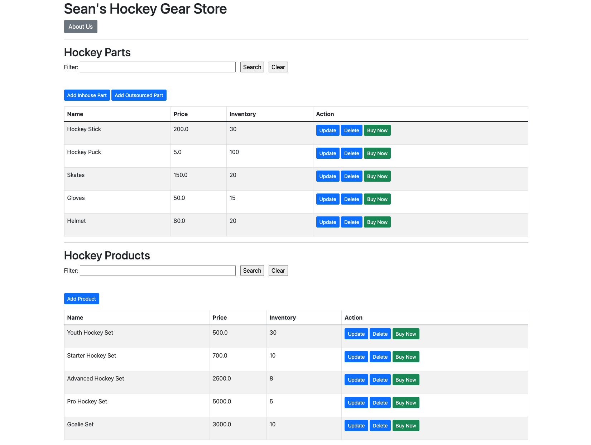

# Seans Hockey Gear Store

This MVP website was built to provided specifications for my college course D287.

# _Java Frameworks_

This project was generated with [WGU GitLab Environment](https://gitlab.com/wgu-gitlab-environment/students/d287-java-frameworks/-/jobs/6984048303)

#### By _**Sean Keane**_
#### WGU Code Review 06/02/2024

### Built Application

## Changes Made For Parts C - J

### Part C Changes:

#### Customized HTML UI for "Sean's Hockey Gear Store
- **File** `src/main/resources/templates/mainscreen.html`
- **Line** 14
- **Change Made** Updated the title tag
- **Line** 19
- **Change Made** Updated h1 tag
- **Lines** 43-45
- **Changes Made** Updated part name, price, and inventory
- **Lines** 79-81
- **Changes Made** Updated product name, price, and inventory

### Part D Changes

#### Added an about page and implemented its navigation
- **File** `src/main/resources/templates/mainscreen.html`
- **Lines** 20-22
- **Change Made** Added navigation element to the About Page
- **File** `src/main/java/com.example.demo/controllers/MainScreenControllerr`
- **Lines** 56-59
- **Change Made** Added a method to controller to handle requests to the about page
- **File** `src/main/resources/templates/about.html`
- **Lines** New File
- **Change Made** Created the about page with information about the store

### Part E Changes

#### Created sample inventory with five parts and five products
- **File** `src/main/resources/applications.properties`
- **Line** 7
- **Change Made** Updated database name for testing purposes
- **File** `src/main/java/com.example.demo/bootstrap/BootStrapData.java`
- **Lines** 36-97
- **Changes Made** Instantiated the parts and products for the hockey shop.  The name, price, inventory, and ID's were created, along with saving these items to their respective repos.

### Part F Changes

#### Added functional Buy Now buttons to the parts and products.  Also implemented error handling
- **File** `src/main/resources/templates/mainscreen.html`
- **Lines** 90-93
- **Change Made** Added a "Buy Now" button next to the update and delete buttons for products
- **File** `src/main/resources/templates/mainscreen.html`
- **Lines** 51-54
- **Change Made** Added a "Buy Now" button next to the update and delete buttons for parts
- **File** `src/main/java/com.example.demo/controllers/MainScreenControllerr`
- **Lines** 42-52
- **Change Made** Added a method to handle the "Buy Now" button functionality for products
- **File** `src/main/java/com.example.demo/controllers/MainScreenControllerr`
- **Lines** 56-54
- **Change Made** Added a method to handle the "Buy Now" button functionality for parts
- **File** `src/main/java/com.example.demo/service/ProductService.java`
- **Lines** 12
- **Change Made** Added the decrementInventory method to the ProductService file to handle decrementing inventory after purchase
- **File** `src/main/java/com.example.demo/service/ProductServiceImpl.java`
- **Lines** 60-71
- **Change Made** Added the decrementInventory method to the ProductServiceImpl file to handle decrementing inventory after purchase and saves the updated products.
- **File** `src/main/java/com.example.demo/service/PartService.java`
- **Lines** 12
- **Change Made** Added the decrementInventory method to the PartService file to handle decrementing inventory after purchase
- **File** `src/main/java/com.example.demo/service/PartServiceImpl.java`
- **Lines** 60-71
- **Change Made** Added the decrementInventory method to the PartServiceImpl file to handle decrementing inventory after purchase and saves the updated parts.
- **File** `src/main/resources/templates/buyPartError.html`
- **Lines** New File
- **Change Made** Created error handling file for a failed purchase of a part
- **File** `src/main/resources/templates/buyProductError.html`
- **Lines** New File
- **Change Made** Created error handling file for a failed purchase of a product
- **File** `src/main/resources/templates/buyProductSuccess.html`
- **Lines** New File
- **Change Made** Created confirmation message file for a successful purchase of a product
- **File** `src/main/resources/templates/buyPartSuccess.html`
- **Lines** New File
- **Change Made** Created confirmation message file for a successful purchase of a part

### Part G Changes

#### Added logic to adapt maximum and minimum inventory for the frontend user
- **File**`src/main/java/com.example.demo/domain/Part.java`
- **Lines**: 1-5
- **Change Made**: Added import statements for `ValidInventory`.
- **Lines**: 9-10
- **Change Made**: Added the `@ValidInventory` annotation to enforce inventory validation.
- **Lines**: 17-25
- **Change Made**: Added fields for `minInv` and `maxInv` with getters and setters. Added the `@NotNull` and `@Min` annotations
- **Lines**: 67-73
- **Change Made**: Added getters and setters for the `minInv` and `maxInv` fields
- **File** `src/main/java/com.example.demo/bootstrap/BootStrapData.java`
- **Lines**: 73-83
- **Change Made**: Added Min and Max values to all the parts
- **File**: `src/main/resources/templates/InhousePartForm.html`
- **Lines**: 34-44
- **Change Made**: Added input fields for `minInv` and `maxInv`
- **File**: `src/main/resources/application.properties`
- **Lines**: 5-6
- **Change**: Updated the datasource URL to point to newly named database
- **File** `src/main/java/com.example.demo/service/PartServiceImpl.java`
- **Lines**: 52-57
- **Change Made**: Added validation to the save method to ensure the inventory is between the `min` and `max` values
- **File** `src/main/java/com.example.demo/validators/validInventory.java`
- **Lines**: New File
- **Change Made**: Created a custom annotation for inventory validation
- **File** `src/main/java/com.example.demo/validators/InventoryValidator.java`
- **Lines**: New File
- **Change Made**: Created logic for the custom inventory validator
- **File** `src/main/java/com.example.demo/templates/productForm.html`
- **Lines**: 14-20, 22-28, 30-36
- **Change Made**: Added descriptors next to text boxes for easier updating/navigation
- **File** `src/main/java/com.example.demo/templates/productForm.html`
- **Lines**: 74-75
- **Change Made**: Uncommented navigation to main screen for intuitive workflow
- **File** `src/main/java/com.example.demo/templates/OutsourcedPartForm.html`
- **Lines**: 14-51
- **Change Made**: Added labels and inputs for the minInv and maxInv
- **File** `src/main/java/com.example.demo/templates/OutsourcedPartForm.html`
- **Lines**: 14-51
- **Change Made**: Added labels and inputs for the minInv and maxInv
- **File** `src/main/resources/templates/about.html`
- **Lines** 15
- **Change Made** Added navigation to main screen to match the rest of the application

### Part H Changes

#### Added validation and error handling for min and max fields
- **File** `src/main/resources/templates/productForm.html`
- **Lines** 23-31, 35-44
- **Change Made** Added columns for the min and max inventories for the available parts and associated parts tables
- **File** `src/main/java/com/example/demo/controllers/AddProductController.java`
- **Lines** 39-52
- **Change Made** Added validation logic to check if updating a product would cause associated parts to fall below the set minimum inventory
- **File** `src/main/resources/templates/lowInventoryError.html`
- **Lines** New File
- **Change Made** Created new HTML file to display an error message when the inventory update would fall outside the minimum inventory
- **File** `src/main/java/com/example/demo/service/PartServiceImpl.java`
- **Lines** 45-50
- **Change Made** Added validation logic to the inventory part selected is between the `min/max` parameters
- **File** `src/main/java/com/example/demo/service/PartService.java`
- **Lines** 10-15
- **Change Made** Updated the interface to reflect the changes in the `save` method
- **File** `src/main/java/com/example/controllers/AddProductController.java`
- **Lines** 51-58
- **Change Made** Added validation to check if the inventory of associated parts falls below their minimum balance
- **File** `src/main/java/com/example/controllers/AddInhousePartController.java`
- **Lines** 28-36
- **Change Made** Updated variable name and removed conditional logic.
- **File** `src/main/java/com/example/demo/bootstrap/BootStrapData.java`
- **Lines** 10-19
- **Change Made** Removed some unused import statements and cleaned up a few formatting preferences
- **File** `src/main/java/com/example/demo/templates/InHousePartForm.html`
- **Lines**: 19, 46-47, 53
- - **Change Made** Added Name error notification.  Added red error when conditions met. Updated link to styled button.
- **File** `src/main/java/com/example/demo/templates/OutsourcedPartForm.html`
- **Lines**: 19, 49-53, 59
- **Change Made** Added Name error notification.  Added red error when conditions met. Updated link to styled button.
- **File** `src/main/java/com/example/demo/domain/Part.java`
- **Lines**: 15, 141
- **Change Made**: Added the error message, `Inventory must be between the min and max values`.  Added new line.
- **File** `src/main/java/com/example/demo/validators/PartInventory.java`
- **Lines**: New File
- **Change Made**: Created new validator class to enforce inventory limits
- **File** `src/main/java/com/example/demo/validators/ValidPartInventory.java`
- **Lines**: New File
- **Change Made**: Created new annotation for validating part inventory based on their min/max

### Part I Changes

#### Added unit tests for min/max inventory
- **File** `src/main/test/java/com.example.demo/domain/PartTest.java`
- **Lines**: 160-194
- **Change Made**: Testing Max: Tests tha max inventory is correctly retrieved.
- Testing Max: Tests the max inventory is correctly set.
- Testing Min: Tests the min inventory is correctly retrieved.
- Testing Min: Tests the min inventory is correctly set.
- Verified all added tests are passing.

### Part J Changes

#### Removed class files and cleaned up solution
- **File** `src/main/java/com/example/demo/validators/DeletePartValidator.java`
- **Lines** Deleted File
- **Change Made** Removed file as it was unused
- **File** `src/main/java/resources/templates/about.html`
- **Lines** 15
- **Change Made** Updated home button
- **File** `src/main/java/com/example/demo/controllers/AddPartController.java`
- **Lines** New File
- **Change Made** Created new HTML file to display an error message when the inventory update would fall outside the minimum inventory
- **File** `src/main/java/com/example/demo/service/PartServiceImpl.java`
- **Lines** 36-39
- **Change Made** Added a break within the loop if conditions are met and changed formatting
- **File** `src/main/java/com/example/demo/controllers/AddProductController.java`
- **Lines** 2, 23
- **Change Made** Added line back for standard formatting and final for best practices to the PartService
- **File** `src/main/java/com/example/demo/validators/DeletePartValidator.java`
- **Lines** Deleted File
- **Change Made** Removed file as it was not in use
- **File** `src/main/java/com/example/demo/bootstrap/BootStrapData.java`
- **Lines** 4, 103-118
- **Change Made** Removed unused import.  Removed comments at bottom of file.
- **File** `src/main/java/com/example/demo/validators/EnufPartsValidator.java`
- **Lines** 4, 13-18
- **Change Made** Removed comments 
- **File** `src/main/java/com/example/demo/validators/InhousePart.java`
- **Lines** 4, 6-11
- **Change Made** Removed comments
- **File** `src/resources/templates/InhousePartForm.html`
- **Lines** 53
- **Change Made** Updated home button to match rest of site
- **File** `src/main/java/com/example/demo/service/InhousePartService.java`
- **Lines** 4-5, 8-11
- **Change Made** Removed unused imports. Removed comments.
- **File** `src/main/java/com/example/demo/service/InhousePartServiceImpl.java`
- **Lines** 4, 6, 13-18
- **Change Made** Removed unused import.  Removed unused import. Removed comments.
- **File** `src/main/java/com/example/demo/validators/InventoryValidator.java`
- **Lines** 4
- **Change Made** Removed unused import.
- **File** `src/main/java/com/example/demo/repositories/OutsourcedPartRepository.java`
- **Lines** 6-11
- **Change Made** Removed comments.
- **File** `src/main/java/com/example/demo/service/OutsourcedPartService.java`
- **Lines** 4, 8-13
- **Change Made** Removed unused import. Removed comments.
- **File** `src/main/java/com/example/demo/service/OutsourcedPartServiceImpl.java`
- **Lines** 13
- **Change Made** Added final for best practices to declaration
- **File** `src/main/java/com/example/demo/domain/Part.java`
- **Lines** 14
- **Change Made** Removed unused class
- **File** `src/main/java/com/example/demo/validators/PartInventory.java`
- **Lines** 15-18
- **Change Made** Tidied up logic to a single line
- **File** `src/main/java/com/example/demo/repositories/PartRepository.java`
- **Lines** 4, 10-15
- **Change Made** Removed unused import.  Removed comments.
- **File** `src/main/java/com/example/demo/service/PartService.java`
- **Lines** 3
- **Change Made** Removed unused import.
- **File** `src/main/java/com/example/demo/validators/PriceProductValidator.java`
- **Lines** 5-7, 16-21, 42-46
- **Change Made** Removed unused import. Removed comments.  Cleaned up redundant logic.
- **File** `src/main/java/com/example/demo/domain/Product.java`
- **Lines** 12-17
- **Change Made** Removed comments.
- **File** `src/main/resources/templates/productForm.html`
- **Lines** 84
- **Change Made** Updated button to match rest of site.
- **File** `src/main/java/com/example/demo/repositories/ProductRepository.java`
- **Lines** 9-14, 11
- **Change Made** Removed comments.  Removed public declaration as its implicit.
- **File** `src/main/java/com/example/demo/service/ProductService.java`
- **Lines** 6-12
- **Change Made** Removed public declarations as their implicit.
- **File** `src/main/java/com/example/demo/service/ProductService.java`
- **Lines** 6-12
- **Change Made** Removed public declarations as their implicit.
- **File** `src/main/java/com/example/demo/validators/ValidDeletePart.java`
- **Lines** Deleted File
- **Change Made** Removed file as it was unused.
- **File** `src/main/java/com/example/demo/validators/ValidProductPrice.java`
- **Lines** 10-15
- **Change Made** Removed comments

## Technologies Used

* HTML
* Java

## Description
_This is a project I created for my B.S. in Software Engineering that manages inventory for my fictional hockey gear store.  It breaks down inventory into two sections, part and products.  Products are a configurable parts bundles.  The user is able to buy products/parts, delete products/parts, and update products/parts.  Developing this application helped me grow my understanding of Java and HTML_

## Setup/Installation Requirements

1) Clone this repository to your desktop.
2) Navigate to the now installed directory and open in your editor of choice.
3) Run the project by clicking the play button.  This is next to 'DemoApplication' in the top right of the IDE.
4) Open your browser of choice and navigate to `http://localhost:8080/mainscreen`.

## Known Bugs

* No known bugs.

## License

If you have any questions or concerns, feel free to contact me at code@sean-keane.com

*This is licensed under the MIT license*

Copyright (c) 05-30-2024 **_Sean Keane_**
